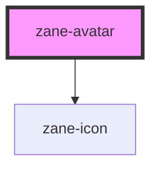

# zane-avatar

<!-- Auto Generated Below -->

## Properties

| Property | Attribute | Description | Type                                                       | Default     |
| -------- | --------- | ----------- | ---------------------------------------------------------- | ----------- |
| `alt`    | `alt`     |             | `string`                                                   | `undefined` |
| `fit`    | `fit`     |             | `"contain" \| "cover" \| "fill" \| "none" \| "scale-down"` | `'cover'`   |
| `icon`   | `icon`    |             | `string`                                                   | `undefined` |
| `shape`  | `shape`   |             | `"circle" \| "square"`                                     | `'circle'`  |
| `size`   | `size`    |             | `"default" \| "large" \| "small" \| number`                | `'default'` |
| `src`    | `src`     |             | `string`                                                   | `''`        |
| `srcSet` | `srcset`  |             | `string`                                                   | `undefined` |

## Events

| Event      | Description | Type                 |
| ---------- | ----------- | -------------------- |
| `imgError` |             | `CustomEvent<Event>` |

## Dependencies

### Depends on

- [zane-icon](../icon)

### Graph

----------------------------------------------

*Built with [StencilJS](https://stenciljs.com/)*
