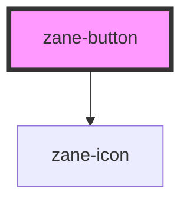

# zane-button

<!-- Auto Generated Below -->

## Properties

| Property          | Attribute           | Description | Type                                                                           | Default     |
| ----------------- | ------------------- | ----------- | ------------------------------------------------------------------------------ | ----------- |
| `autoInsertSpace` | `auto-insert-space` |             | `boolean`                                                                      | `undefined` |
| `autofocus`       | `autofocus`         |             | `boolean`                                                                      | `false`     |
| `bg`              | `bg`                |             | `boolean`                                                                      | `false`     |
| `circle`          | `circle`            |             | `boolean`                                                                      | `false`     |
| `color`           | `color`             |             | `string`                                                                       | `undefined` |
| `dark`            | `dark`              |             | `boolean`                                                                      | `false`     |
| `disabled`        | `disabled`          |             | `boolean`                                                                      | `false`     |
| `icon`            | `icon`              |             | `string`                                                                       | `undefined` |
| `link`            | `link`              |             | `boolean`                                                                      | `false`     |
| `loading`         | `loading`           |             | `boolean`                                                                      | `false`     |
| `nativeType`      | `native-type`       |             | `"button" \| "reset" \| "submit"`                                              | `'button'`  |
| `plain`           | `plain`             |             | `boolean`                                                                      | `undefined` |
| `round`           | `round`             |             | `boolean`                                                                      | `undefined` |
| `size`            | `size`              |             | `"" \| "default" \| "large" \| "small"`                                        | `undefined` |
| `text`            | `text`              |             | `boolean`                                                                      | `undefined` |
| `type`            | `type`              |             | `"" \| "danger" \| "default" \| "info" \| "primary" \| "success" \| "warning"` | `''`        |

## Events

| Event    | Description | Type                      |
| -------- | ----------- | ------------------------- |
| `zClick` |             | `CustomEvent<MouseEvent>` |

## Dependencies

### Depends on

- [zane-icon](../icon)

### Graph

----------------------------------------------

*Built with [StencilJS](https://stenciljs.com/)*
