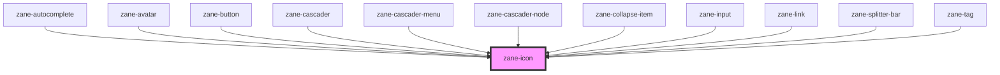

# zane-icon

<!-- Auto Generated Below -->

## Properties

| Property     | Attribute     | Description | Type      | Default     |
| ------------ | ------------- | ----------- | --------- | ----------- |
| `classNames` | `class-names` |             | `string`  | `''`        |
| `color`      | `color`       |             | `string`  | `undefined` |
| `name`       | `name`        |             | `string`  | `undefined` |
| `rotate`     | `rotate`      |             | `number`  | `undefined` |
| `size`       | `size`        |             | `string`  | `undefined` |
| `spin`       | `spin`        |             | `boolean` | `undefined` |
| `styles`     | --            |             | `object`  | `undefined` |

## Dependencies

### Used by

 - [zane-autocomplete](../autocomplete)
 - [zane-avatar](../avatar)
 - [zane-button](../button)
 - [zane-cascader](../cascader)
 - [zane-cascader-menu](../cascader)
 - [zane-cascader-node](../cascader)
 - [zane-collapse-item](../collapse)
 - [zane-input](../input)
 - [zane-link](../link)
 - [zane-splitter-bar](../splitter)
 - [zane-tag](../tag)

### Graph

----------------------------------------------

*Built with [StencilJS](https://stenciljs.com/)*
