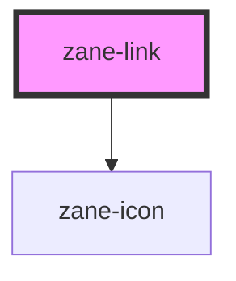

# zane-link

<!-- Auto Generated Below -->

## Properties

| Property    | Attribute   | Description | Type                                                                     | Default     |
| ----------- | ----------- | ----------- | ------------------------------------------------------------------------ | ----------- |
| `disabled`  | `disabled`  |             | `boolean`                                                                | `undefined` |
| `href`      | `href`      |             | `string`                                                                 | `''`        |
| `icon`      | `icon`      |             | `string`                                                                 | `undefined` |
| `target`    | `target`    |             | `string`                                                                 | `'_self'`   |
| `type`      | `type`      |             | `"danger" \| "default" \| "info" \| "primary" \| "success" \| "warning"` | `undefined` |
| `underline` | `underline` |             | `"always" \| "hover" \| "never" \| boolean`                              | `undefined` |

## Events

| Event    | Description | Type                      |
| -------- | ----------- | ------------------------- |
| `zClick` |             | `CustomEvent<MouseEvent>` |

## Dependencies

### Depends on

- [zane-icon](../icon)

### Graph

----------------------------------------------

*Built with [StencilJS](https://stenciljs.com/)*
