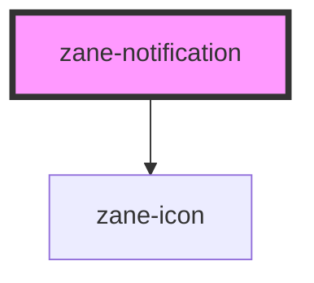

# zane-notification

<!-- Auto Generated Below -->

## Properties

| Property                   | Attribute                        | Description               | Type                                                             | Default       |
| -------------------------- | -------------------------------- | ------------------------- | ---------------------------------------------------------------- | ------------- |
| `closeIcon`                | `close-icon`                     | 自定义关闭图标                   | `string`                                                         | `'close'`     |
| `customClass`              | `custom-class`                   | 自定义类名                     | `string`                                                         | `''`          |
| `dangerouslyUseHTMLString` | `dangerously-use-h-t-m-l-string` | 是否将 message 作为 HTML 字符串渲染 | `boolean`                                                        | `false`       |
| `duration`                 | `duration`                       | 自动关闭延迟时间（毫秒），设为 0 则不自动关闭  | `number`                                                         | `4500`        |
| `icon`                     | `icon`                           | 自定义图标                     | `string`                                                         | `''`          |
| `message`                  | `message`                        | 描述文本                      | `string`                                                         | `''`          |
| `notificationId`           | `notification-id`                | 通知 DOM id                 | `string`                                                         | `''`          |
| `notificationTitle`        | `notification-title`             | 标题文字                      | `string`                                                         | `''`          |
| `offset`                   | `offset`                         | 距离屏幕边缘的基础偏移量（由外部动态覆盖）     | `number`                                                         | `0`           |
| `position`                 | `position`                       | 通知位置                      | `"bottom-left" \| "bottom-right" \| "top-left" \| "top-right"`   | `'top-right'` |
| `showClose`                | `show-close`                     | 是否显示关闭按钮                  | `boolean`                                                        | `true`        |
| `type`                     | `type`                           | 通知类型                      | `"" \| "error" \| "info" \| "primary" \| "success" \| "warning"` | `''`          |
| `zIndex`                   | `z-index`                        | 初始 z-index 层级             | `number`                                                         | `2000`        |

## Events

| Event     | Description | Type                |
| --------- | ----------- | ------------------- |
| `destroy` | 销毁事件        | `CustomEvent<void>` |

## Dependencies

### Depends on

- [zane-icon](../icon)

### Graph

----------------------------------------------

*Built with [StencilJS](https://stenciljs.com/)*
