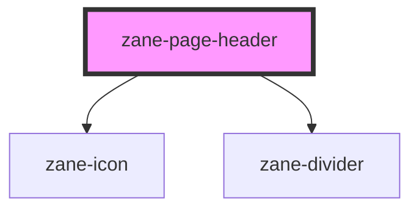

# zane-page-header

<!-- Auto Generated Below -->

## Properties

| Property    | Attribute    | Description | Type     | Default             |
| ----------- | ------------ | ----------- | -------- | ------------------- |
| `backTitle` | `back-title` |             | `string` | `undefined`         |
| `content`   | `content`    |             | `string` | `''`                |
| `icon`      | `icon`       |             | `string` | `'arrow-left-line'` |

## Events

| Event   | Description | Type                |
| ------- | ----------- | ------------------- |
| `zBack` |             | `CustomEvent<void>` |

## Dependencies

### Depends on

- [zane-icon](../icon)
- [zane-divider](../divider)

### Graph

----------------------------------------------

*Built with [StencilJS](https://stenciljs.com/)*
