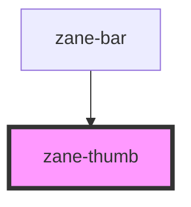

# zane-thumb

<!-- Auto Generated Below -->

## Properties

| Property   | Attribute  | Description | Type      | Default     |
| ---------- | ---------- | ----------- | --------- | ----------- |
| `always`   | `always`   |             | `boolean` | `undefined` |
| `move`     | `move`     |             | `number`  | `undefined` |
| `ratio`    | `ratio`    |             | `number`  | `undefined` |
| `size`     | `size`     |             | `string`  | `undefined` |
| `vertical` | `vertical` |             | `boolean` | `undefined` |

## Dependencies

### Used by

 - [zane-bar](.)

### Graph

----------------------------------------------

*Built with [StencilJS](https://stenciljs.com/)*
