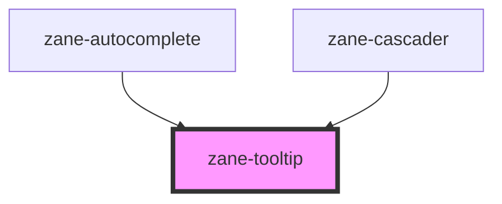

# zane-tooltip

<!-- Auto Generated Below -->

## Properties

| Property                 | Attribute              | Description | Type                                                                                                                                                                                                         | Default                      |
| ------------------------ | ---------------------- | ----------- | ------------------------------------------------------------------------------------------------------------------------------------------------------------------------------------------------------------ | ---------------------------- |
| `allowHTML`              | `allow-h-t-m-l`        |             | `boolean`                                                                                                                                                                                                    | `true`                       |
| `animateFill`            | `animate-fill`         |             | `boolean`                                                                                                                                                                                                    | `false`                      |
| `animation`              | `animation`            |             | `boolean \| string`                                                                                                                                                                                          | `'fade'`                     |
| `appendTo`               | `append-to`            |             | `"parent" \| ((ref: Element) => Element) \| Element`                                                                                                                                                         | `TIPPY_DEFAULT_APPEND_TO`    |
| `aria`                   | --                     |             | `{ content?: "auto" \| "describedby" \| "labelledby"; expanded?: boolean \| "auto"; }`                                                                                                                       | `{ content: 'describedby' }` |
| `arrow`                  | `arrow`                |             | `DocumentFragment \| SVGElement \| boolean \| string`                                                                                                                                                        | `true`                       |
| `content`                | `content`              |             | `((ref: Element) => string \| Element \| DocumentFragment) \| DocumentFragment \| Element \| string`                                                                                                         | `''`                         |
| `delay`                  | `delay`                |             | `[number, number] \| number`                                                                                                                                                                                 | `0`                          |
| `disabled`               | `disabled`             |             | `boolean`                                                                                                                                                                                                    | `false`                      |
| `duration`               | `duration`             |             | `[number, number] \| number`                                                                                                                                                                                 | `300`                        |
| `followCursor`           | `follow-cursor`        |             | `"horizontal" \| "initial" \| "vertical" \| boolean`                                                                                                                                                         | `false`                      |
| `getReferenceClientRect` | --                     |             | `GetReferenceClientRect`                                                                                                                                                                                     | `null`                       |
| `hideOnClick`            | `hide-on-click`        |             | `"toggle" \| boolean`                                                                                                                                                                                        | `true`                       |
| `ignoreAttributes`       | `ignore-attributes`    |             | `boolean`                                                                                                                                                                                                    | `false`                      |
| `inertia`                | `inertia`              |             | `boolean`                                                                                                                                                                                                    | `false`                      |
| `inlinePositioning`      | `inline-positioning`   |             | `boolean`                                                                                                                                                                                                    | `true`                       |
| `interactive`            | `interactive`          |             | `boolean`                                                                                                                                                                                                    | `false`                      |
| `interactiveBorder`      | `interactive-border`   |             | `number`                                                                                                                                                                                                     | `2`                          |
| `interactiveDebounce`    | `interactive-debounce` |             | `number`                                                                                                                                                                                                     | `0`                          |
| `maxWidth`               | `max-width`            |             | `number \| string`                                                                                                                                                                                           | `350`                        |
| `moveTransition`         | `move-transition`      |             | `string`                                                                                                                                                                                                     | `''`                         |
| `offset`                 | --                     |             | `(({ placement, popper, reference, }: { placement: Placement; popper: Rect; reference: Rect; }) => [number, number]) \| [number, number]`                                                                    | `[0, 10]`                    |
| `placement`              | `placement`            |             | `"auto" \| "auto-end" \| "auto-start" \| "bottom" \| "bottom-end" \| "bottom-start" \| "left" \| "left-end" \| "left-start" \| "right" \| "right-end" \| "right-start" \| "top" \| "top-end" \| "top-start"` | `'top'`                      |
| `plugins`                | --                     |             | `Plugin<unknown>[]`                                                                                                                                                                                          | `[]`                         |
| `popperOptions`          | --                     |             | `{ placement: Placement; modifiers: Partial<Modifier<any, any>>[]; strategy: PositioningStrategy; onFirstUpdate?: (arg0: Partial<State>) => void; }`                                                         | `{}`                         |
| `role`                   | `role`                 |             | `string`                                                                                                                                                                                                     | `'tooltip'`                  |
| `showOnCreate`           | `show-on-create`       |             | `boolean`                                                                                                                                                                                                    | `false`                      |
| `sticky`                 | `sticky`               |             | `"popper" \| "reference" \| boolean`                                                                                                                                                                         | `false`                      |
| `theme`                  | `theme`                |             | `string`                                                                                                                                                                                                     | `''`                         |
| `tippyRender`            | --                     |             | `(instance: Instance<Props>) => { onUpdate?: (prevProps: Props, nextProps: Props) => void; popper: PopperElement<Props>; }`                                                                                  | `undefined`                  |
| `touch`                  | `touch`                |             | `"hold" \| ["hold", number] \| boolean`                                                                                                                                                                      | `true`                       |
| `trigger`                | `trigger`              |             | `string`                                                                                                                                                                                                     | `'mouseenter focus'`         |
| `triggerTarget`          | --                     |             | `Element \| Element[]`                                                                                                                                                                                       | `null`                       |
| `zIndex`                 | `z-index`              |             | `number`                                                                                                                                                                                                     | `9999`                       |

## Events

| Event           | Description | Type                           |
| --------------- | ----------- | ------------------------------ |
| `zClickOutside` |             | `CustomEvent<Instance<Props>>` |
| `zHidden`       |             | `CustomEvent<Instance<Props>>` |
| `zHide`         |             | `CustomEvent<Instance<Props>>` |
| `zMount`        |             | `CustomEvent<Instance<Props>>` |
| `zShow`         |             | `CustomEvent<Instance<Props>>` |

## Methods

### `disable() => Promise<void>`

#### Returns

Type: `Promise<void>`

### `enable() => Promise<void>`

#### Returns

Type: `Promise<void>`

### `hide() => Promise<void>`

#### Returns

Type: `Promise<void>`

### `isFocusInsideContent(event?: FocusEvent) => Promise<boolean>`

#### Parameters

| Name    | Type         | Description |
| ------- | ------------ | ----------- |
| `event` | `FocusEvent` |             |

#### Returns

Type: `Promise<boolean>`

### `isVisible() => Promise<boolean>`

#### Returns

Type: `Promise<boolean>`

### `show() => Promise<void>`

#### Returns

Type: `Promise<void>`

### `updateTippyInstance() => Promise<void>`

#### Returns

Type: `Promise<void>`

## Dependencies

### Used by

 - [zane-autocomplete](../autocomplete)
 - [zane-cascader](../cascader)

### Graph

----------------------------------------------

*Built with [StencilJS](https://stenciljs.com/)*
